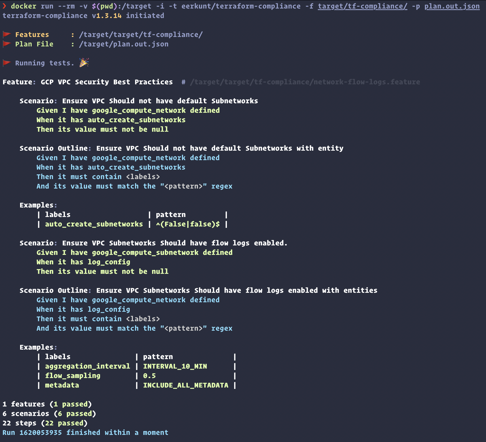

# POC of Terraform Compliance
### Terraform Compliance to meet VPC Hardening needs in GCP using BDD.




**Resource**
1. GCP VPC Network (Without Default subnetworks).
2. Create Subnetwork (with Enabled VPC Flow logs).

**Test Include.**
- `google_compute_network` should have `auto_create_subnetworks` entity.
  - Should not be **NULL**.
  - should not be **True**.
- `google_compute_subnetwork` should have `log_config` entity.
  - Should not be **NULL**.
  - should have following pattern.

  ```
   | aggregation_interval			| INTERVAL_10_MIN	    |
   | flow_sampling			    | 0.5	                |
   | metadata			            | INCLUDE_ALL_METADATA	|
  ```

Steps :
```
terraform plan -out=plan.out
terraform show -json plan.out > plan.out.json
docker run --rm -v $(pwd):/target -i -t eerkunt/terraform-compliance -f target/tf-compliance/ -p plan.out.json
```